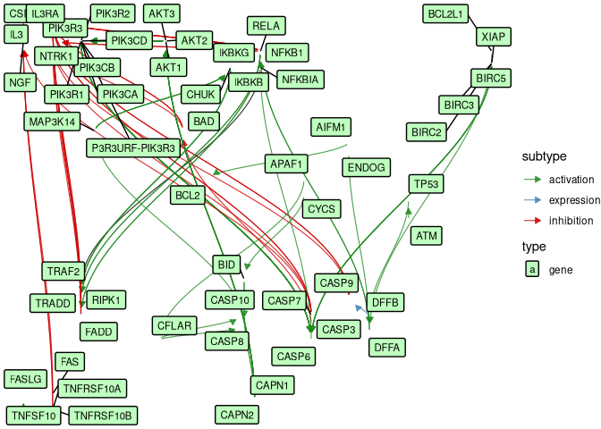

<!-- README.md is generated from README.Rmd. Please edit that file -->

# punKEGGer

<!-- badges: start -->

[](https://lifecycle.r-lib.org/articles/stages.html)
<!-- badges: end -->

The goal of **punKEGGer** is to parse, expand, annotate and visualize
KEGG pathway networks as tidy graphs. It supports multi-gene entries,
group nodes, KEGG layout coordinates, and external annotation via
BioMart-like dictionaries.

## Installation

You can install the development version of punKEGGer from
[GitHub](https://github.com/) with:

`{r}} # install.packages("pak") pak::pak("guillermodeandajauregui/punKEGGer")`

## Example

``` r
library(punKEGGer)
library(xml2)

# Step 1: Load KGML from KEGG API
kgml <- read_xml("https://rest.kegg.jp/get/hsa04210/kgml")

# Step 2: Get KEGG layout
mi_layout <- layout_kegg(kgml)

# Step 3: Build raw network and extract node info
g <- combine_kegg_network(kgml)
node_info <- extract_kegg_nodes(kgml)

# Step 4: Expand group/multi-gene entries
g_expanded <- expand_metagraph(g, node_info, node_types = c("gene", "compound"))

# Step 5: Load example dictionary included with package
dict_path <- system.file("extdata", "example_dict.hsa04210.csv", package = "punKEGGer")
kegg_dict <- read.csv(dict_path)

# Step 6: Annotate graph with HGNC, Entrez, Ensembl
meta_dict <- create_meta_dict(node_info, kegg_dict)
g_annotated <- annotate_kegg_graph(g_expanded, meta_dict, identifiers = c("hgnc_symbol", "entrez_id", "ensembl_id"))

# Step 7: Add layout and visualize
g_annotated_layout <- add_kegg_layout(g_annotated, mi_layout)
ggkegg(g_annotated_layout, id = hgnc_symbol)
```



## About the dictionary

The file `example_dict.hsa04210.csv` is included under `inst/extdata/`.
It provides basic annotation for KEGG entries in this example.

Your own dictionary must: - Be a tibble with a `kegg_id` column using
KEGG-style IDs (e.g., `"hsa:1234"`) - Optionally include columns like
`hgnc_symbol`, `ensembl_id`, `entrez_id`, etc.

You can build a full dictionary using `biomaRt`, KEGG API, or other
mapping sources.

## License

MIT © Guillermo de Anda Jáuregui
